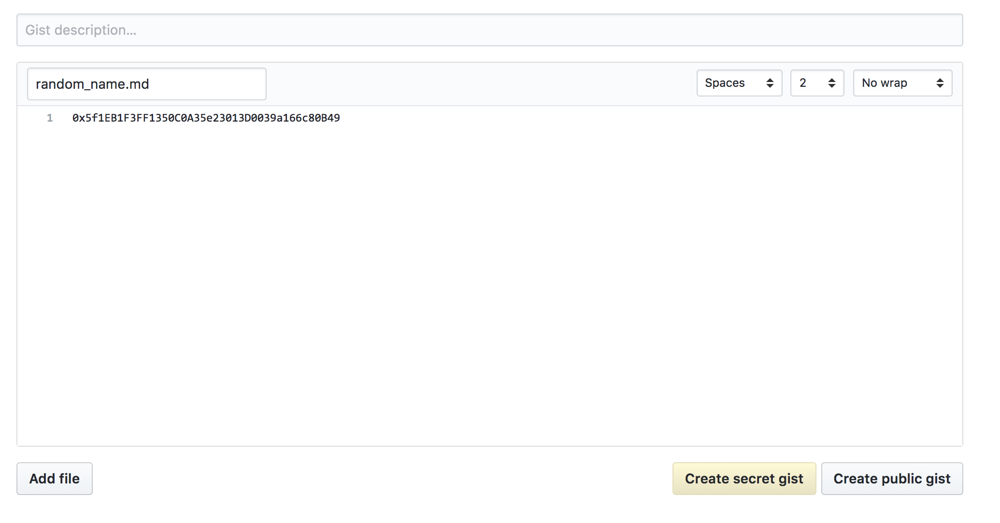

# faucet-erc20
***Automated faucet for distributing ERC20 Tokens***

### Networks

* Kovan

### Tokens

* SingularityNET (AGI)

Vulpem Ventures has set up a faucet service that uses a Github Gist identifier to store an address where your ERC20 Tokens can be sent to. This allows up to 1 ERC20 Token every 24 hours. This requires you have a github account.

1) Go to http://gist.github.com 
2) Ccreate a new entry with the text being your ethereum address (even secret it's fine)

3)once you save this your browser should have reloaded at a new url. 

Copy from the given url the alphanumeric string after your username

`eg. https://gist.github.com/<Your_Github_Username>/ff1d965dd0cfcfacf3ad919b4cdeba9f`

So you need to copy just 
***ff1d965dd0cfcfacf3ad919b4cdeba9f*** and paste it in the form in the [client](https://vulpemventures.github.io/faucet-erc20/)
